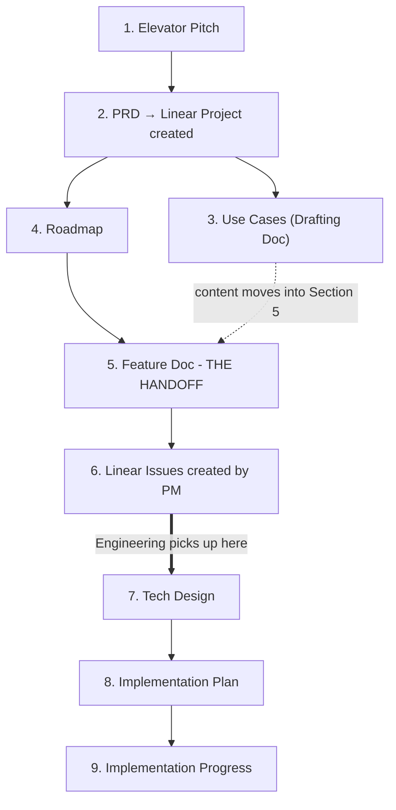

# PM-Engineering Document System

> This document defines how features move from idea to delivered product. Every feature follows the same 9-document pipeline, split across two phases: Product (PM-owned) and Engineering (Eng-owned). The Feature Doc is the handoff point between them.

---

## Overview

The system has 9 documents in two phases:

- **Product phase (docs 1–6):** PM discovers, scopes, defines the feature, and creates tickets
- **Engineering phase (docs 7, 8, 9):** Engineering designs, plans, builds, and tracks it
- **The Feature Doc (#5) is the handoff** — the contract between Product and Engineering



---

## The 9 Documents

| # | Document | Written By | Reviewed By | Purpose |
|---|----------|------------|-------------|---------|
| 1 | **Elevator Pitch** | CPO / PM + AI | CEO, leadership | Is this worth building? 1-pager framing the problem, hypothesis, and success bar |
| 2 | **PRD** | CPO / PM + AI | CEO, DoE, leadership | Shared mental model for the initiative — problem, solution, goals, non-goals, success metrics |
| 3 | **Use Cases** *(Drafting Doc)* | CPO / PM | CPO / PM (internal) | PM working tool for mapping workflows before the Feature Doc. Content moves into Feature Doc §5 and this doc is superseded |
| 4 | **Roadmap** | CPO / PM + AI | CEO, leadership | Prioritized list of features and initiatives with sequencing |
| **5 ★** | **Feature Doc** *(The Handoff)* | CPO / PM + AI | CEO, DoE, EM, Eng | The contract between Product and Engineering. Defines what and why, with full use cases and PASS/FAIL acceptance criteria inline in Section 5 |
| 6 | **Linear Tickets** | CPO / PM + AI | CPO / PM, EM | Tickets created by PM from Feature Doc §5 use cases and ACs. Not created until §5 is complete |
| 7 | **Tech Design** | Engineer + AI | DoE, CPO / PM | Defines the how — architecture, data model, API flows, risks, trade-offs |
| 8 | **Implementation Plan** | Engineer + AI | DoE, EM, Eng, CPO / PM | Breaks the how into granular, testable phases with effort estimates. Each phase = 1 PR |
| 9 | **Implementation Progress** | AI | EM, CPO / PM | Tracks execution — phase status, blockers, deviations from the plan, testing evidence |

*Abbreviations: **CPO** — Chief Product Officer | **DoE** — Sakr, Director of Engineering | **EM** — Mustafa, Eng Manager | **Eng** — assigned engineer on the feature | **AI** — Windsurf / Cursor / Claude Code*

---

## Phase 1: Product (PM-Owned)

Documents 1–6 are owned by Product. The Feature Doc (#5) is the output Engineering builds from.

### 1. Elevator Pitch — Is this worth building?

A 1-page brief written before any scoping begins. Frames the problem, the hypothesis, and what success looks like. The goal is to get leadership agreement that the problem is real and the idea is worth further investment.

**Done when:** CEO and leadership agree the problem is worth pursuing.
**Template:** `01-elevator-pitch-template.md` | **PM-OS skill:** `/elevator-pitch`

---

### 2. PRD — The shared mental model

Scoped at the initiative level, not individual features. Defines the problem, proposed solution, goals, non-goals, and how we measure success. The PRD exists to create alignment before Feature Docs are written — so everyone is building toward the same outcome.

> **When the PRD is created, a Linear Project is created from it.** The project name = the initiative name. All Feature Docs under this PRD will have their Linear Issues linked to this project. The Linear Project link goes in the PRD Meta table (Section 0).

**Done when:** Leadership alignment is locked and Linear Project is created.
**Template:** `02-prd-template.md` | **PM-OS skill:** `/prd-draft`

---

### 3. Use Cases (Drafting Doc) — PM working tool only

Used while building the PRD and Feature Doc to map out workflows, think through scenarios, and draft acceptance criteria before the Feature Doc is written.

> **This doc gets superseded.** Once the Feature Doc is written, all use cases are copied into Section 5 — fully, with PASS/FAIL criteria. Two docs covering the same content will go out of sync. The Feature Doc is the source of truth. Mark this doc's status as "Superseded" once the Feature Doc is complete.

**Done when:** Content has been moved to Feature Doc §5.
**Template:** `03-use-cases-template.md`

---

### 4. Roadmap — What we're building and when

Prioritized list of initiatives and features with sequencing. Lives at the initiative level. Sets the context for which Feature Docs need to be written and in what order.

**Done when:** Leadership has agreed on priorities for the planning cycle.
**Template:** `04-roadmap-template.md` | **PM-OS skill:** `/roadmap`

---

### 5. Feature Doc ★ — The Handoff

The contract between Product and Engineering. A Feature Doc is complete when an engineer can read it and build without Slacking the PM. If they need to ask for context, the doc isn't done.

> **A prototype is required before this doc is sent to Engineering.** Use any tool: Figma, v0, Claude Artifacts, Lovable, Bolt, or any other prototyping tool. The prototype link must be in Section 2. No prototype = not ready to hand off.

**Sections:**
1. Feature Overview (problem, solution, why)
2. Scope (in scope, out of scope, **prototype link required**)
3. Solution Overview (journey, edge cases, example outputs)
4. Handshake Matrix (upstream dependencies, downstream consumers)
5. **Use Cases** — full use cases with PASS/FAIL acceptance criteria written here
6. Rollout Plan
7. Rules and Compliance
8. Open Questions

> **Use cases live in Section 5 — written fully, not linked.** Engineers build against them. QA tests against them. Every time the Feature Doc evolves, the use cases evolve with it. There is no separate use cases doc once this is written.
>
> Each use case includes: **who is doing what and why**, **step-by-step interaction flow**, and **binary PASS/FAIL acceptance criteria**. "Works correctly" is not a criterion.

**Done when:** All 8 sections complete, prototype link present in Section 2, use cases have binary ACs, handshake matrix filled.
**Template:** `05-feature-doc-template.md` | **PM-OS skill:** `/feature-doc-draft`

---

### 6. Linear Issues — PM creates immediately after the Feature Doc

Granular issues created by the PM directly from the Feature Doc the moment it is complete. Source: Section 5 use cases and their acceptance criteria. Created before handing off to Engineering — so engineers have clear, trackable work items from day one.

> **Tickets are only created from the Feature Doc — specifically from Section 5.** If Section 5 is empty or just a link, stop. The Feature Doc is incomplete. No tickets until use cases have binary PASS/FAIL criteria written inline.

**Done when:** Every use case in Section 5 has at least one corresponding ticket with clear acceptance criteria.
**PM-OS skill:** `/create-tickets`

---

## Phase 2: Engineering (Eng-Owned)

Documents 7, 8, and 9 are owned by Engineering. Engineering does not start until the Feature Doc is approved.

### 7. Tech Design — The how

Architecture decisions, data model, API design, system flows, risks, and trade-offs. Written after reading and understanding the Feature Doc. PM reviews to confirm the tech approach aligns with the product intent.

**Done when:** DoE reviews and CPO / PM confirms it matches the product intent.

---

### 8. Implementation Plan — Phases and effort

Breaks the tech design into granular, testable phases with effort estimates and dependencies. Each phase maps to one PR. Reviewed by DoE, EM, Eng, and CPO / PM before engineering begins.

**Done when:** DoE, EM, Eng, and CPO / PM sign off on phasing and effort.

---

### 9. Implementation Progress — Execution tracker

Maintained by AI (Windsurf / Cursor / Claude Code) during implementation. Tracks phase status, blockers, deviations from the implementation plan, and testing evidence. Updated after each phase.

**Done when:** All phases shipped, release checklist complete, feature demo approved by CEO / DoE / CPO / PM.

---

## How to Start a New Feature

1. **Check the roadmap** — confirm the feature is prioritized and has PRD coverage
2. **PRD creates a Linear Project** — if not already created, `/prd-draft` will prompt to create the Linear Project. The project link goes in the PRD Meta table.
3. **Draft Use Cases (optional)** — use the Use Cases doc to map workflows before writing the Feature Doc, especially for complex flows
4. **Write the Feature Doc** — include full use cases inline in Section 5 with PASS/FAIL ACs. Get prototype link before sending to Engineering.
5. **Get Feature Doc approved** — CEO, DoE, EM sign off
6. **PM creates Linear Issues immediately** — run `/create-tickets` right after Feature Doc approval. Issues are created in the Linear Project from step 2, sourced from Section 5.
7. **Hand off to Engineering** — share the Feature Doc + Linear Issues link. Engineering reads both before starting the Tech Design.
8. **Engineering writes the Tech Design** — PM reviews to confirm alignment with product intent
9. **Engineering writes the Implementation Plan** — PM and DoE review
10. **Engineering builds phase by phase** — each phase = 1 PR, tracked in the Implementation Progress doc
11. **Feature demo** approved before marking done

---

## Folder Structure

Templates live in PM-OS:

```
pmos/
└── templates/
    ├── 00-pm-engineering-system.md     <- This file
    ├── 01-elevator-pitch-template.md
    ├── 02-prd-template.md
    ├── 03-use-cases-template.md        <- Drafting only. Superseded by Feature Doc.
    ├── 04-roadmap-template.md
    └── 05-feature-doc-template.md      <- The Handoff
```

All working docs — PM and Engineering — live together in the product repo:

```
product-engineering/
└── [initiative-name]/              <- e.g., ai-concierge, onboarding, pharmacy-ehr
    ├── 00-elevator-pitch.md
    ├── 01-prd.md
    ├── 02-use-cases.md             <- Drafting only. Content moves to feature docs.
    ├── 03-roadmap.md
    ├── 04-[feature-1-name]/        <- One folder per feature
    │   ├── 01-feature-doc.md       <- PM writes this (The Handoff)
    │   ├── 02-tech-design.md       <- Eng writes this
    │   ├── 03-implementation-plan.md
    │   └── 04-implementation-progress.md
    ├── 05-[feature-2-name]/
    │   ├── 01-feature-doc.md
    │   ├── 02-tech-design.md
    │   ├── 03-implementation-plan.md
    │   └── 04-implementation-progress.md
    └── 06-[feature-3-name]/
        ├── 01-feature-doc.md
        ├── 02-tech-design.md
        ├── 03-implementation-plan.md
        └── 04-implementation-progress.md
```

Each initiative folder has initiative-level docs (elevator pitch, PRD, use cases, roadmap) at the root, then one numbered subfolder per feature. Each feature subfolder contains all 4 docs — the Feature Doc written by PM, and the 3 Engineering docs written by Eng.

---

## Feature Lifecycle

A feature moves through these states:

1. **Idea** — Elevator Pitch written and approved
2. **Scoped** — PRD written and approved
3. **Defined** — Feature Doc written and approved (the handoff)
4. **Designed** — Tech Design written and approved
5. **Planned** — Implementation Plan written and approved, tickets created
6. **In Progress** — Engineering building phase by phase
7. **Done** — Release checklist complete, feature demo approved

---

## Key Rules

- **Use cases belong in the Feature Doc** — Section 5, written fully inline, with binary PASS/FAIL criteria. Not in a standalone doc.
- **No Linear Issues without a complete Feature Doc** — Section 5 must be fully written before issues are created
- **PRD → Linear Project** — every PRD automatically creates a Linear Project. The project link lives in the PRD Meta table.
- **Feature Doc → Linear Issues** — PM creates Linear Issues immediately after Feature Doc approval, before handing off to Engineering
- **PM creates issues** — not Engineering. Source is always Feature Doc §5.
- **Feature Doc before Tech Design** — Engineering does not start until the Feature Doc is approved and Linear Issues are created
- **No document skipping** — each document must pass its review gate before the next begins
- **Document deviations** — if implementation differs from the plan, record why in the Implementation Progress doc
- **AI-assisted, human-reviewed** — AI helps write every document, humans approve every gate
