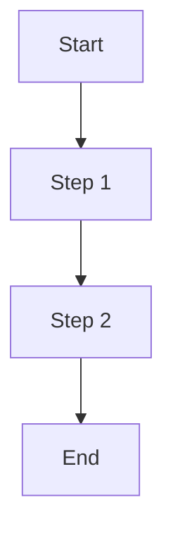

# Feature Doc Template

> **What this is:** The contract between Product and Engineering. A Feature Doc is complete when an engineer can read it and build without asking questions. If they need to Slack for context, the doc isn't done.
>
> **What this is NOT:** A PRD (no initiative-level scope here) or a tech design (no architecture decisions).
>
> **When to use:** One Feature Doc per deliverable unit. Use Cases are written fully in Section 5 — not linked, not in a separate doc. Engineers build against them. QA tests against them. They stay here.

---

> This document is written by the Product Leader

- **Tracker:** [Linear/Jira link here]
- **Parent PRD:** [Link to PRD, or N/A if standalone]
- **Status:** Draft / In Review / Approved / In Build / Shipped
- **Last Updated:** [Date]

---

## 1. The Feature Overview (Strategy)

- **The Problem:** [1-2 sentences — the user pain point. Who feels it, how often, what breaks without this.]
- **The Solution:** [1-2 sentences — what we are building. Outcome, not features.]
- **The "Why" (ROI):**
  - [e.g., Reduces manual data entry by 40%]
  - [e.g., Eliminates X support tickets per week]

---

## 2. The Scope

### In Scope

1. **[Subfeature 1]:** [1-2 sentences describing what it does and why it's in this Feature Doc]
2. **[Subfeature 2]:** [1-2 sentences]

- **Prototype:** [Link — REQUIRED before sending to Engineering. Any tool works: Figma, v0, Claude Artifacts, Lovable, Bolt, etc.]

### Out of Scope

1. [Out-of-scope item] — [why]
2. [Out-of-scope item] — [why]

---

## 3. Solution Overview

### Journey

1. [Step 1: User does X]
2. [Step 2: System responds with Y]
3. [Step 3: User completes Z]

> Include flowchart if the flow has branching logic. Delete if linear.

### Edge Cases

| Edge Case | How We Handle It |
|-----------|-----------------|
| [e.g., User submits empty form] | [Show inline error, block submission] |
| [e.g., API timeout] | [Retry once, then show error state] |

### Example Outputs

[List one or more concrete example outputs. For AI features: example inputs and expected outputs. For UI features: describe what the user sees.]

---

## 4. Handshake Matrix

> What does this feature depend on, and what depends on it? Surfaces cross-team coordination early.

**Upstream Dependencies (what this feature needs):**

| Dependency | What It Provides | Impact If Missing |
|------------|-----------------|-------------------|
| [e.g., Identity-core SSO] | [User authentication tokens] | [Cannot complete signup flow] |

**Downstream Consumers (what depends on this feature):**

| Consumer | What It Needs | Impact If Broken |
|----------|--------------|-----------------|
| [e.g., AI Concierge routing] | [CareTeam data for task routing] | [Tasks routed to wrong entity] |

---

## 5. Use Cases

> Use cases live here — fully written, not linked. Engineers build against them. QA tests against them. Every time the Feature Doc changes, the use cases change with it. There is no separate use cases doc once this Feature Doc is written.
>
> Each use case answers: who is doing what and why, what the step-by-step interaction is, and what PASS/FAIL looks like.

---

### Use Case 1: [Short title]

[1-2 sentences — the scenario: who is doing what, and why.]

**Steps:**

1. [User action or system event]
2. [Next step]
3. [Next step]

**Acceptance Criteria:**

1. [Observable outcome — PASS if X, FAIL if Y]
2. [Observable outcome — PASS if X, FAIL if Y]
3. [Observable outcome — PASS if X, FAIL if Y]

---

### Use Case 2: [Short title]

[1-2 sentences — the scenario: who is doing what, and why.]

**Steps:**

1. [User action or system event]
2. [Next step]
3. [Next step]

**Acceptance Criteria:**

1. [Observable outcome — PASS if X, FAIL if Y]
2. [Observable outcome — PASS if X, FAIL if Y]

---

> Add as many use cases as needed. Each one must have a scenario, steps, and binary acceptance criteria. No fuzzy language — "works correctly" is not a criterion.

---

## 6. Rollout Plan

**Approach:** A/B Test / Phased Rollout / Full Launch

| Phase | Audience | Duration | Pass Criteria |
|-------|----------|----------|---------------|
| Phase 1 | [who, % traffic, segments] | [duration] | [metrics to hit] |
| Phase 2 | [expand to] | [duration] | [metrics to hit] |
| GA | [everyone] | Ongoing | [steady-state monitoring] |

---

## 7. Rules and Compliance Requirements

> Include regulatory, legal, or policy constraints that shape this feature. Delete section if not applicable.

- [e.g., HIPAA: patient consent required before sharing PHI across entities]
- [e.g., 42 CFR Part 2: substance use disorder data requires explicit opt-in, even for treatment]
- [e.g., State-specific licensing: entity types must match state regulatory categories]

**Guardrail Metrics** (must not harm):

| Metric | Acceptable Range |
|--------|-----------------|
| [e.g., Task completion rate] | [Must not drop below X%] |

---

## 8. Open Questions

- [ ] [Question] — @[owner] — due [date]
- [ ] [Question] — @[owner] — due [date]

---

## Feature Doc Quality Checklist

### Before Sending to Engineering
- [ ] Problem stated in 1-2 sentences — specific about who feels it and how often
- [ ] Solution described in terms of outcome, not features
- [ ] All in-scope items listed with 1-2 sentence descriptions
- [ ] Non-goals are explicit and agreed on
- [ ] Prototype link present in Section 2 (Figma, v0, Claude Artifacts, Lovable, Bolt, or equivalent)
- [ ] Journey steps cover the full user flow end-to-end
- [ ] Edge cases documented with handling
- [ ] Use Cases written fully in Section 5 — not linked, not in a separate doc
- [ ] Every use case has binary acceptance criteria (PASS/FAIL — not "it works")
- [ ] Handshake matrix complete (upstream deps, downstream consumers)
- [ ] Rollout plan specified
- [ ] Compliance requirements flagged (or section deleted as N/A)
- [ ] Open questions have owners and due dates

### After Approval — Before Handing Off to Engineering

- [ ] Linear Issues created from Section 5 use cases (run `/create-tickets`)
- [ ] Linear Issues linked to the parent Linear Project from the PRD
- [ ] Feature Doc link added to each Linear Issue

> **PM creates Linear Issues immediately after this doc is approved** — not after the Tech Design, not after the Implementation Plan. Engineering should receive both this Feature Doc and the Linear Issues at the same time.

### Definition of Done
This Feature Doc is complete when an engineer can read it and build without Slacking the PM for context, QA can write test cases directly from Section 5 without asking follow-up questions, and Linear Issues have been created and linked.
